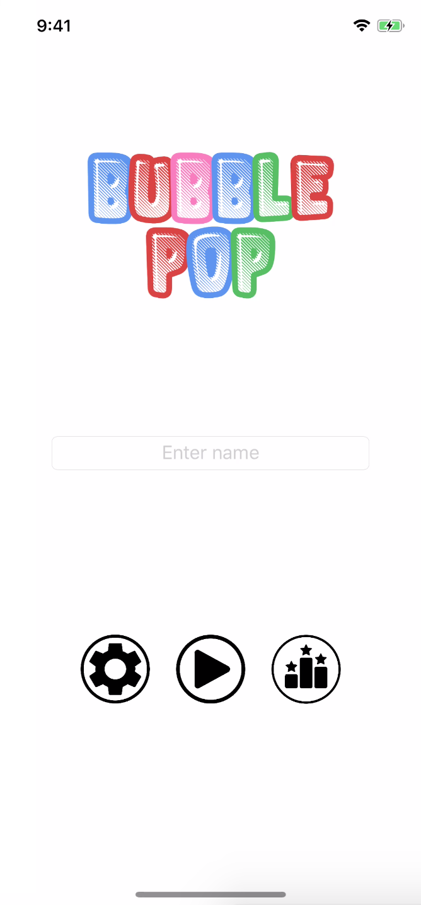

# BubblePop

Bubble popping game for iOS written in Swift 4.1.

This project was done for **41889 Application Development in the iOS Environment** course at UTS.

## Features

* Fast, interactive bubble popping gameplay
* Adjustable time and number of bubbles settings.
* BGM song credit: ["Funny Plays" by SnowMusicStudio](https://www.melodyloops.com/tracks/funny-plays/)

## Gameplay

Click on the screenshot below to play the video preview.

### Points

| Colour | Game Points | Probability of Appearance |
| :----: | ----------: | ------------------------: |
|  Red   |           1 |                       40% |
|  Pink  |           2 |                       30% |
| Green  |           5 |                       15% |
|  Blue  |           8 |                       10% |
| Black  |          10 |                        5% |

> Table 1. Specifications for coloured bubbles

If two or more bubbles of the same colour are popped consecutively, you will earn combo 1.5 times the points for the additional bubbles popped.
